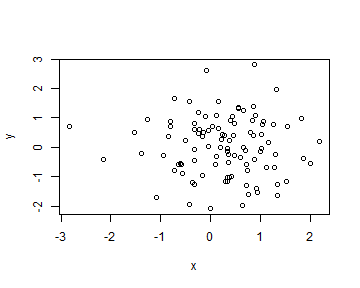

## Create slides with bullet points:

1. Insert Markdown


$$\frac{-b \pm \sqrt{b^2 - 4 a c}}{2a}$$

2. Use an empty line followed by three dashes to separate slides! 


--- .class #id 


## Interact with R!
1. Code up in R, display code, or not, your choice and display a plot.


```r
y <- rnorm(100); x <- rnorm(100)       
plot(x,y)
```

 

2. When plotting, be aware of the size of the plot.  Adjust size by adding fig.width, and 
fig.height to the r code chunk.

--- .class #id 

## Another example of interaction with R!
1.  Create anothe simple plot!

```r
require(ggplot2)
qplot(wt, mpg, data = mtcars)
```


--- .class #id 

## Final Points

1. Slidify makes interactive presenations a breeze.
2. Incorporate R code, and charts and be on your way to a professional presenation that will help you deliver a confident message and a wonderful experience for your audience.

--- 
